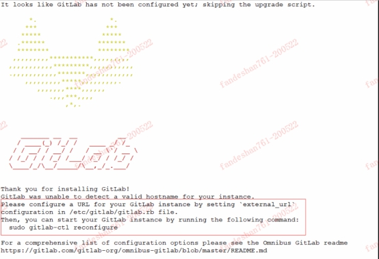
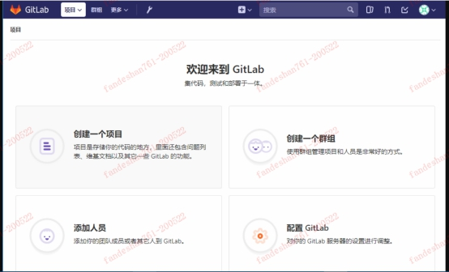
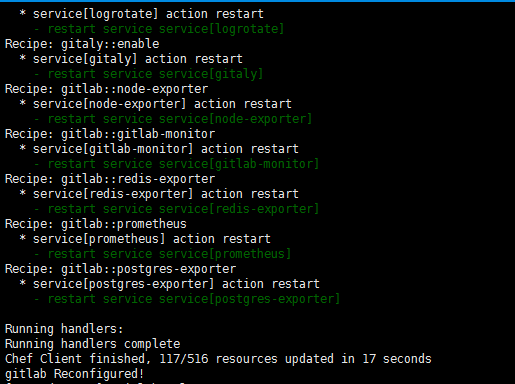
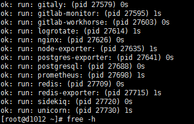

### GITLAB安装 

安装环境：

（1）CentOS 7  

（2）2G内存（实验）生产（至少4G），不然会很卡

（3）安装包：gitlab-ce-10.2.2-ce

（4）禁用防火墙，关闭selinux

 

gitlab官网地址：https://about.gitlab.com/ 

gitlab说明：

```shell
/etc/gitlab/gitlab.rb      #gitlab配置文件

/opt/gitlab           #gitlab的程序安装目录

/var/opt/gitlab         #gitlab目录数据目录

/var/opt/gitlab/git-data    #存放仓库数据

gitlab-ctl reconfigure     #重新加载配置

gitlab-ctl status        #查看当前gitlab所有服务运行状态

gitlab-ctl stop         #停止gitlab服务

gitlab-ctl stop nginx      #单独停止某个服务

gitlab-ctl tail         #查看所有服务的日志
```

Gitlab的服务构成：

nginx：         静态web服务器

gitlab-workhorse     轻量级反向代理服务器

logrotate        日志文件管理工具

postgresql       数据库

redis          缓存数据库

sidekiq         用于在后台执行队列任务（异步执行）

安装依赖

```shell
yum install -y curl policycoreutils-python openssh-server     #安装依赖
```

下载软件包：

```shell
wget https://mirrors.tuna.tsinghua.edu.cn/gitlab-ce/yum/el7/gitlab-ce-10.2.2-ce.0.el7.x86_64.rpm  #下载软件包
```


安装软件包：

```shell
rpm -ivh gitlab-ce-10.2.2-ce.0.el7.x86_64.rpm   #安装gitlab
```


 

根据安装完成提示界面进行访问URL更改及重新加载配置文件 更改次选项为自己的域名或者IP   external_url 'http://gitlab.example.com'

```shell
vim /etc/gitlab/gitlab.rb    #编辑配置文件
```

```
external_url 'http://192.168.1.21'     #改为自己的IP地址
```

```
gitlab-ctl reconfigure   #重新加载配置文件
```

重装完成访问http://192.168.1.21，会首先叫更改密码（root用户），改完后登录。如下界面：

 

#### 汉化


1、下载汉化补丁

```shell
git clone https://gitlab.com/xhang/gitlab.git

cd gitlab   
```

2、查看全部分支版本

```
git branch -a
```

3、对比版本、生成补丁包

```shell
git diff remotes/origin/10-2-stable remotes/origin/10-2-stable-zh > /tmp/10.2.2-zh.diff
```

4、停止服务器

```shell
gitlab-ctl stop
```

5、打补丁

```
patch -d /opt/gitlab/embedded/service/gitlab-rails -p1 < /tmp/10.2.2-zh.diff
```

6、启动和重新配置


```shell
gitlab-ctl start
gitlab-ctl reconfigure
```

汉化完成后再次刷新页面如下

 


#### 内存占用过高问题

修改gitlab.rb文件

```shell
vim /etc/gitlab/gitlab.rb
```

修改内容如下

```shell
unicorn['worker_processes'] = 2  ##减少工作进程数
unicorn['worker_memory_limit_min'] = "200 * 1 << 20"  ##限制最小工作内存200M
unicorn['worker_memory_limit_max'] = "350 * 1 << 20"  ##限制最大工作内存300M
sidekiq['concurrency'] = 16    ##限制sidekiq的并发数
postgresql['shared_buffers'] = "256MB"  ##设置数据库缓存大小
postgresql['max_worker_processes'] = 8  ##设置数据库并发
```

修改完成之后重新加载配置

```shell
gitlab-ctl reconfigure
```

可以看到加载完成



重新启动gitlab

```shell
gitlab-ctl restart
```

