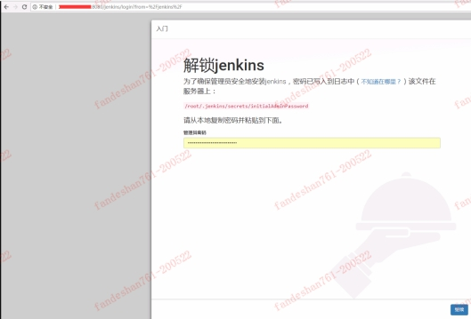
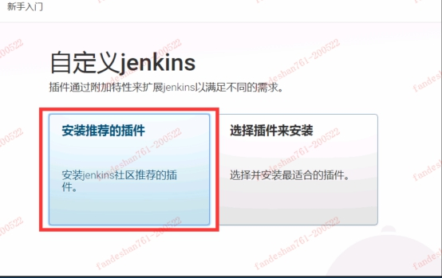
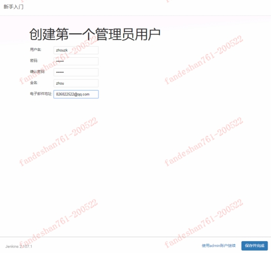

### JENKINS安装 

检测是否安装了jdk，若需要安装可参照安装jdk

```shell
java -version
```

安装依赖

```shell
yum install glibc.i686
```

***安装tomcat:***
下载或上传tomcat

```shell
tar -xvf apache-tomcat-8.0.50.tar.gz
mv apache-tomcat-8.0.50 tomcat
```

运行jenkins(这里采用war包形式，可到官网用其他形式安装)

官网下载或上传jenkins.war

```shell
cd /data/tomcat/
cp /data/jenkins.war /data/tomcat/webapps/
./bin/startup.sh
```

日志查看（快捷键Ctrl+C返回）：

```shell
tail -f logs/catalina.out
```

访问：

http://服务器地址:8080/jenkins

 


 

 

 

***安装用到的jenkins插件***

​	系统管理 - 插件管理 - 可选插件

​    以下这些都需要安装：

· Deploy to container插件

· git plugin（推荐插件若安装成功，这里不用再次安装了）