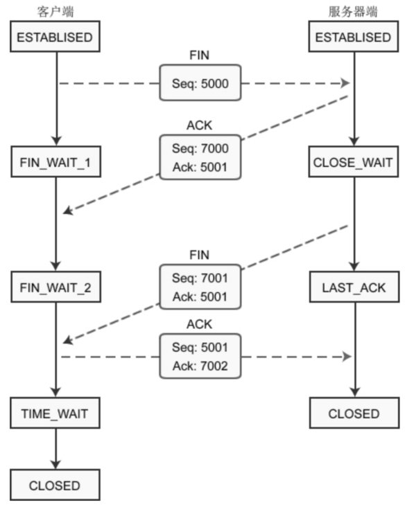
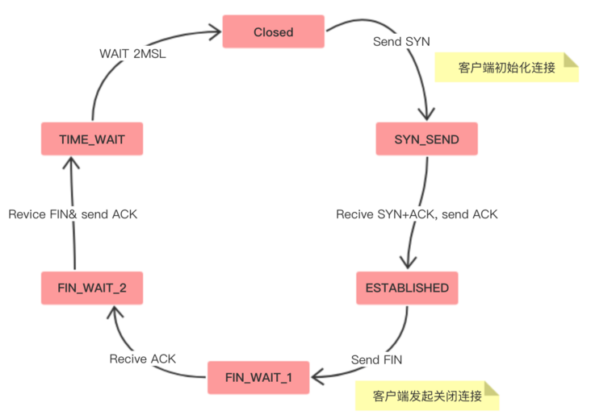
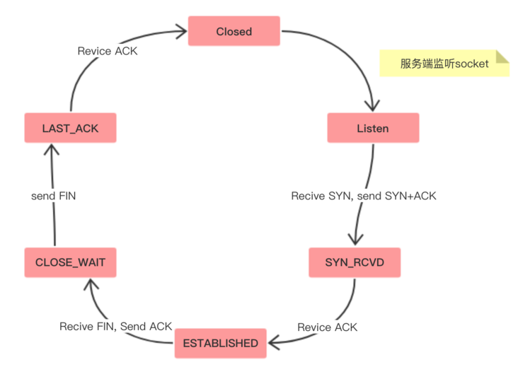
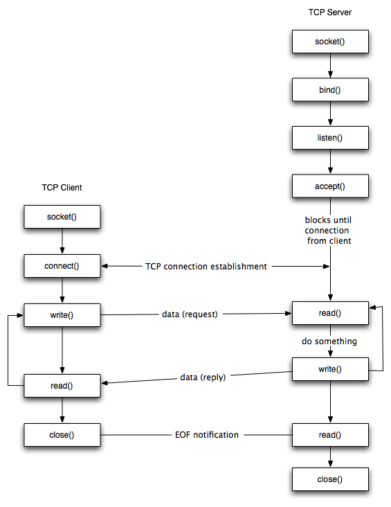

# 高并发常遇到的网络问题


### TCP三次握手


首先当服务端处于 **listen** 状态的时候，我们就可以再客户端发起监听了，此时客户端会处于 **SYN_SENT** 状态。服务端收到这个消息会返回一个 **SYN** 并且同时 **ACK** 客户端的请求，之后服务端便处于 **SYN_RCVD** 状态。这个时候客户端收到了服务端的 **SYN&ACK**，就会发送对服务端的 **ACK**，之后便处于 **ESTABLISHED** 状态。服务端收到了对自己的 **ACK** 后也会处于 **ESTABLISHED** 状态。

经常在面试中可能有人提问：为什么握手要3次，不是2次或者4次呢？

首先说4次握手，其实为了保证可靠性，这个握手次数可以一直循环下去；但是这没有一个终止就没有意义了。所以3次，保证了各方消息有来有回就足够了。当然这里可能有一种情况是，客户端发送的 **ACK** 在网络中被丢了。那怎么办？

1. 其实大部分时候，我们连接建立完成就会立刻发送数据，所以如果服务端没有收到 **ACK** 没关系，当收到数据就会认为连接已经建立；
2. 如果连接建立后不立马传输数据，那么服务端认为连接没有建立成功会周期性重发 **SYN&ACK** 直到客户端确认成功。

再说为什么2次握手不行呢？2次握手我们可以想象是没有三次握手最后的 **ACK**, 在实际中确实会出现客户端发送 **ACK** 服务端没有收到的情况（上面的情况一），那么这是否说明两次握手也是可行的呢？

看下情况二，2次握手当服务端发送消息后，就认为建立成功，而恰巧此时又没有数据传输。这就会带来一种资源浪费的情况。比如：客户端可能由于延时发送了多个连接情况，当服务端每收到一个请求回复后就认为连接建立成功，但是这其中很多求情都是延时产生的重复连接，浪费了很多宝贵的资源。

因此综上所述，从资源节省、效率3次握手都是最合适的。话又回来三次握手的真实意义其实就是协商传输数据用的：**序列号与窗口大小**。

**抓包：** `sudo tcpdump -n host www.baidu.com -S`

> - `S` 表示 SYN
> - `.` 表示 ACK
> - `P` 表示 传输数据
> - `F` 表示 FIN

### 四次挥手




这里有个问题需要注意下，其实客户端、服务端都能够主动发起关闭操作，谁调用 `close()` 就先发送关闭的请求。当然一般的流程，发起建立连接的一方会主动发起关闭请求（http中）。

关于4次挥手的过程，我就不多解释了，这里有两个重要的状态我需要解释下，这都是我亲自经历过的线上故障，**close_wait** 与 **time_wait**。

先给大家一个命令，统计tcp的各种状态情况。下面表格内容就来自这个命令的统计。

```shell
netstat -n | awk '/^tcp/ {++S[$NF]} END {for(a in S) print a, S[a]}'
```

**大量的CLOSE_WAIT** ，它会导致大量的socket无法释放。而每个socket都是一个文件，是会占用资源的。这个问题主要是代码问题。它出现在被动关闭的一方（习惯称为server）。

eg: see : [CLOSE_WAIT问题定位及解决](./close_wait_problem.md)

**大量的TIME_WAIT** 这个问题在日常中经常看到，流量一高就出现大量的该情况。该状态出现在主动发起关闭的一方。该状态一般等待的时间设为 2MSL后自动关闭，**MSL是Maximum Segment Lifetime，报文最大生存时间**，如果报文超过这个时间，就会被丢弃。处于该状态下的socket也是不能被回收使用的。线上我就遇到这种情况，每次大流量的时候，每台机器处于该状态的socket就多达10w+，远远比处于 `Established` 状态的socket多的多，导致很多时候服务响应能力下降。这个一方面可以通过调整内核参数处理，另一方面避免使用太多的短链接，可以采用连接池来提升性能。另外在代码层面可能是由于某些地方没有关闭连接导致的，也需要检查业务代码。

eg: see : [TIME_WAIT实际案例及解决](../nginx/time_wait_problem.md)

上面两个状态一定要牢记发生在哪一方，这方便我们快速定位问题。

最后这里还是放上挥手时的抓包数据：

```shell
20:33:26.750607 IP 192.168.0.102.58165 > 103.235.46.39.80: Flags [F.], seq 621839159, ack 1754967720, win 4096, length 0
20:33:26.827472 IP 103.235.46.39.80 > 192.168.0.102.58165: Flags [.], ack 621839160, win 776, length 0
20:33:26.827677 IP 103.235.46.39.80 > 192.168.0.102.58165: Flags [F.], seq 1754967720, ack 621839160, win 776, length 0
20:33:26.827729 IP 192.168.0.102.58165 > 103.235.46.39.80: Flags [.], ack 1754967721, win 4096, length 0
```

不多不少，刚好4次。

### TCP状态变更

网络上有一张TCP状态机的图，我觉得太复杂了，用自己的方式搞个简单点的容易理解的。我从两个角度来说明状态的变更。

- 一个是客户端
- 一个是服务端

看下面两张图的时候，请一定结合上面三次握手、四次挥手的时序图一起看，加深理解。

#### 客户端状态变更



通过这张图，大家是否能够清晰明了的知道 TCP 在客户端上的变更情况了呢？

#### 服务端状态变更



这一张图描述了 TCP 状态在服务端的变迁。

## TCP的流量控制与拥塞控制

我们常说TCP是面向连接的，UDP是无连接的。那么TCP这个面向连接主要解决的是什么问题呢？

这里继续把三次握手的抓包数据贴出来分析下：

```shell
20:33:26.583598 IP 192.168.0.102.58165 > 103.235.46.39.80: Flags [S], seq 621839080, win 65535, options [mss 1460,nop,wscale 6,nop,nop,TS val 1050275400 ecr 0,sackOK,eol], length 0
20:33:26.660754 IP 103.235.46.39.80 > 192.168.0.102.58165: Flags [S.], seq 1754967387, ack 621839081, win 8192, options [mss 1452,nop,wscale 5,nop,nop,nop,nop,nop,nop,nop,nop,nop,nop,nop,nop,sackOK,eol], length 0
20:33:26.660819 IP 192.168.0.102.58165 > 103.235.46.39.80: Flags [.], ack 1754967388, win 4096, length 0
```

上面我们说到 `TCP` 的三次握手最重要的就是协商传输数据用的序列号。那这个序列号究竟有些什么用呢？这个序号能够帮助后续两端进行确认数据包是否收到，解决顺序、丢包问题；另外我们还可以看到有一个 **win** 字段，这是双方交流的窗口大小，这在每次传输数据过程中也会携带。主要是告诉对方，我窗口是这么大，别发多了或者别发太少。

总结下，TCP的几个特点是：

- 顺序问题，依靠序号
- 丢包问题，依靠序号
- 流量控制，依靠滑动窗口
- 拥塞控制，依靠拥塞窗口+滑动窗口
- 连接维护，三次握手/四次挥手

### 顺序与丢包问题

这个问题其实应该很好理解。由于数据在传输前我们已经有序号了，这里注意一下这个序号是随机的，重复的概率极地，避免了程序发生乱入的可能性。

由于我们每个数据包有序号，虽然发送与到达可能不是顺序的，但是TCP层收到数据后，可以根据序号进行重新排列；另外在这个排列过程中，发现有了1，2，3，5，6这几个包，一检查就知道4要么延时未到达，要么丢包了，等待重传。

这里需要重要说明的一点是。为了提升效率，TCP其实并不是收到一个包就发一个ack。那是如何ACK的呢？还是以上面为例，TCP收到了1,2,3,5,6这几个包，它可能会发送一个 `ack ，seq=3` 的确认包，这样次一次确认了3个包。但是它不会发送 5,6 的ack。因为4没有收到啊！一旦4延时到达或者重发到达，就会发送一个 `ack, seq=6`，又一次确认了3个包。

### 流量控制与拥塞控制

这两个概念说实话，让我理解了挺长时间，主要是对它们各自控制的内容以及相互之间是否有作用一直没有闹清楚。

先大概说下：

- 流量控制：是根据接收方的窗口大小来感知我这次能够传多少数据给对方；———— 滑动窗口
- 拥塞控制：而拥塞控制主要是避免网络拥塞，它考虑的问题更多。根据综合因素来觉得发多少数据给对方；———— 滑动窗口&拥塞窗口

举个例子说下，比如：A给B发送数据，通过握手后，A知道B一次可以收1000的数据（B有这么大的处理能力），那么这个时候滑动窗口就可以设置成1000。那是不是最后真的可以一次发这么多数据给B呢？还不是，这时候得问问拥塞窗口，老兄，现在网络情况怎么样？一次运1000的数据有压力吗？拥塞窗口一通计算说不行，现在是高峰期，最多只能有600的货上路。最终这次传数据的时候就是 600 的标注。大家也可以关注抓包数据的 **win** 值，一直在动态调整。

当然另外一种情况是滑动窗口比拥塞窗口小，虽然运输能力强，但是接收能力有限，这时候就要取滑动窗口的值来实际发生。所以它们二者之间是有关系的。

所以具体到每次能够发送多少数据，有这么一个公式：

> LastByteSend - LastByteAcked <= min{cwnd,rwnd}

- LastByteSend 是最后一个发送的字节的序号
- LastByteAcked 最后一个被确认的字节的序号

这两个相减得到的是本次能够发送的数据，这个数据一定小于或等于 cwnd 与 rwnd 中最小的一个值。相信大家能够理清楚。

那么这部分知识对于实际工作中有什么作用呢？指导意义就是：如果你的业务很重要、很核心一定不要混布；二是如果你的服务忽快忽慢，而确信依赖服务没有问题，检查下机器对应的网络情况；三是窗口这个速度控制机制，在我们进行服务设计的时候，非常具有参考意义。是不是有点消息队列的感觉？（很多消息队列都是匀速的，我们是否可以加一个窗口的概念来进行优化呢？）

## 是什么限制了你的连接

到了最关键的地方了，精华我都是留到最后讲。下面放一张网上找的socket操作步骤图，画的太好了我就直接用了。



我们假设我的服务端就是 `Nginx` ，我来尝试解读一下。当客户端调用 `connect()` 时候就会发起三次握手，这次握手的时候有几个元素唯一确定了这次通信（或者说这个socket），**[源IP:源Port， 目的IP:目的Port]** ，当然这个socket还不是最终用来传输数据的socket，一旦握手完成后，服务端会在返回一个 **socket** 专门用来后续的数据传输。这里暂且把第一个socket叫 **监听socket**，第二个叫 **传输socket** 方便后文叙述。

为什么要这么设计呢？大家想一想，如果监听的socket还要负责数据的收发，请问这个服务端的效率如何提升？什么东西、谁都往这个socket里边丢，太复杂！

### 提高连接常用套路

到了这一步，我们现在先停下来算算自己的服务器机器能够有多少连接呢？这个极限又是如何一步步被突破呢？

先说 **监听socket** ，服务器的prot一般都是固定的，服务器的ip当然也是固定的（单机）。那么上面的结构 **[源IP:源Port， 目的IP:目的Port]** 其实只有客户端的ip与端口可以发生变化。假设客户端用的是IPv4，那么理论连接数是：2^32(ip数) * 2^16(端口数) = 2^48。

看起来这个值蛮大的。但是真的能够有这么多连接吗？不可能的，因为每一个socket都需要消耗内存；以及每一个进程的文件描述符是有上限的。这些都限制了最终的连接数。

那么如何进行调和呢？我知道的操作有：多进程、多线程、IO多路服用、协程等手段组合使用。

#### 多进程

也就是监听是一个进程，一旦accept后，对于 **传输socket** 我们就fork一个新的子进程来处理。但是这种方式太重，fork一个进程、销毁一个进程都是特别费事的。单机对进程的创建上限也是有限制的。

#### 多线程

线程比进程要轻量级的多，它会共享父进程的很多资源，比如：文件描述符、进程空间，它就是多了一个引用。因此它的创建、销毁更加容易。每一个 **传输socket** 在这里就交给了线程来处理。

但是不管是多进程、还是多线程都存在一个问题，一个连接对应一个进程或者协程。这都很难逃脱 **C10K** 的问题。那么该怎么办呢？

#### IO多路复用

IO多路复用是什么意思呢？在上面单纯的多进程、多线程模型中，一个进程或线程只能处理一个连接。用了IO多路复用后，我一个进程或线程就能处理多个连接。

我们都知道 `Nginx` 非常高效，它的结构是：master + worker，worker 会在 80、443端口上来监听请求。它的worker一般设置为 cpu 的cores数，那么这么少的子进程是如何解决超多连接的呢？这里其实每个worker就采用了 epoll 模型（当然IO多路复用还有个select，这里就不说了）。

处于监听状态的worker，会把所有 **监听socket** 加入到自己的epoll中。当这些socket都在epoll中时，如果某个socket有事件发生就会立即被回调唤醒（这涉及epoll的红黑树，讲不清楚不细说了）。这种模式，大大增加了每个进程可以管理的socket数量，上限直接可以上升到进程能够操作的最大文件描述符。

一般机器可以设置百万级别文件描述符，所以单机单进程就是百万连接，**epoll是解决C10K的利器，很多开源软件用到了它。**

> 这里说下，并不是所有的worker都是同时处于监听端口的状态，这涉及到nginx惊群、抢自旋锁的问题，不再本文范围内不多说。

### 关于ulimit

在文章的最后，补充一些单机文件描述符设置的问题。我们常说连接数受限于文件描述符，这是为什么？

因为在linux上一切皆文件，故每一个socket都是被当作一个文件看待，那么每个文件就会有一个文件描述符。在linux中每一个进程中都有一个数组保存了该进程需要的所有文件描述符。这个文件描述符其实就是这个数组的 `key` ，它的 `value` 是一个指针，指向的就是打开的对应文件。

关于文件描述符有两点注意：

1. 它对应的其实是一个linux上的文件
2. 文件描述符本身这个值在不同进程中是可以重复的

另外补充一点，单机设置的ulimit的上线受限与系统的两个配置：

> fs.nr_open，进程级别
>
> fs.file-max，系统级别

fs.nr_open 总是应该小于等于 fs.file-max，这两个值的设置也不是随意可以操作，因为设置的越大，系统资源消耗越多，所以需要根据真实情况来进行设置。