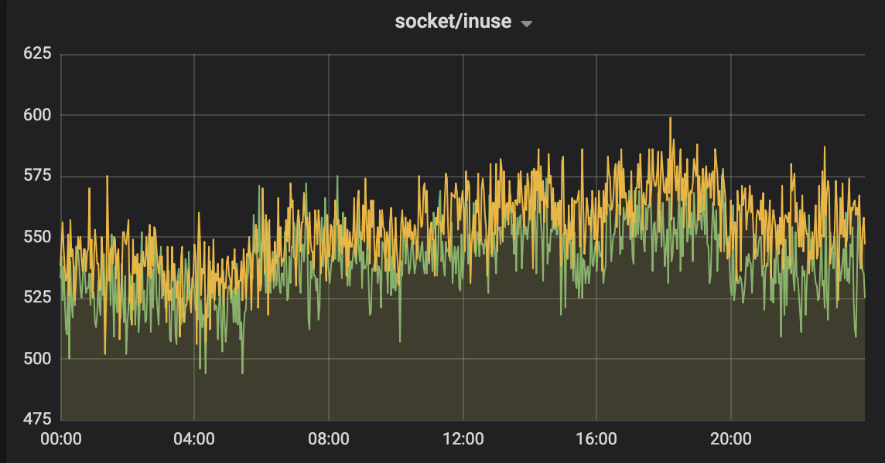
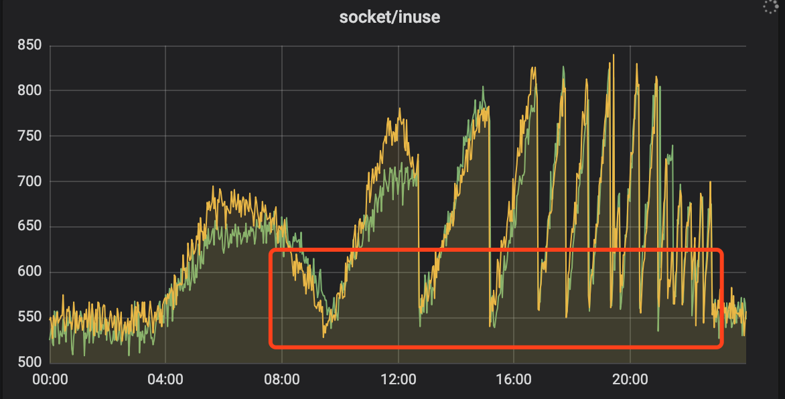
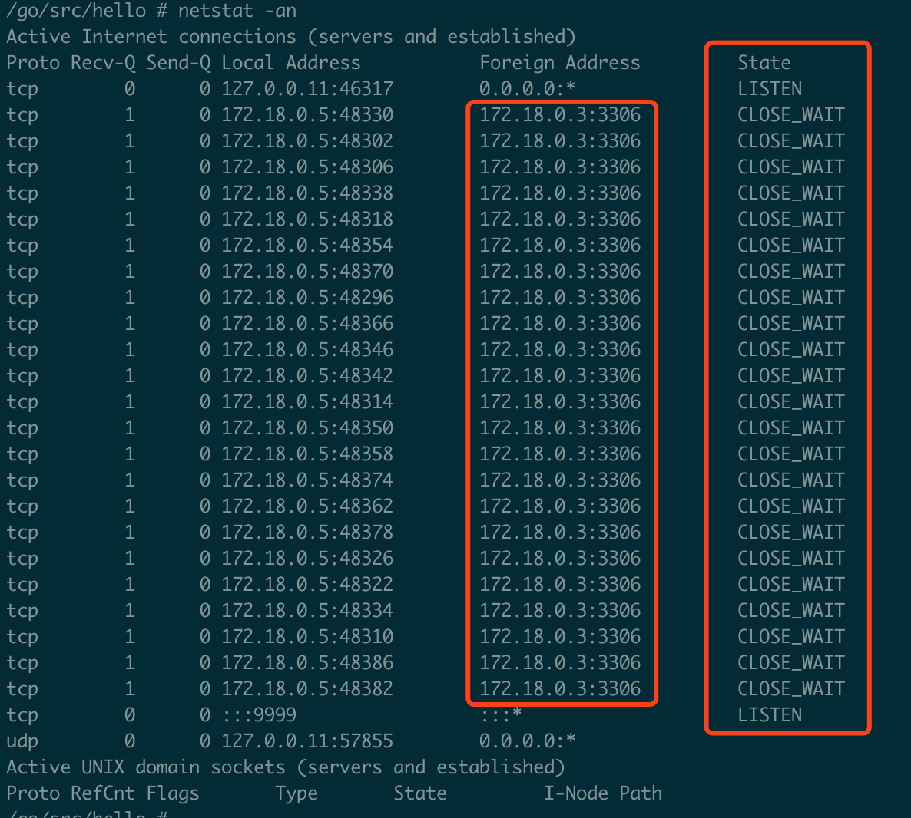
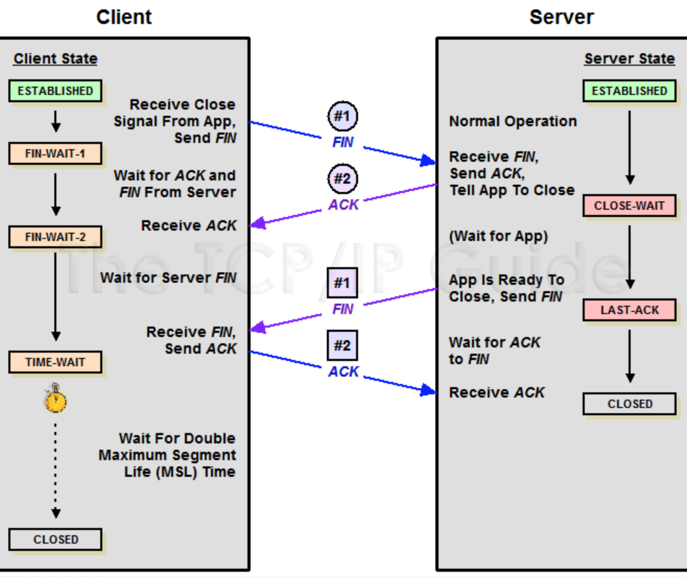
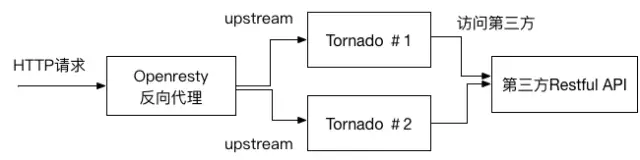
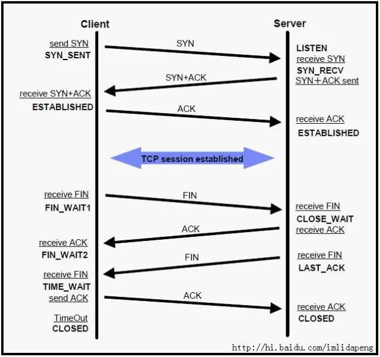
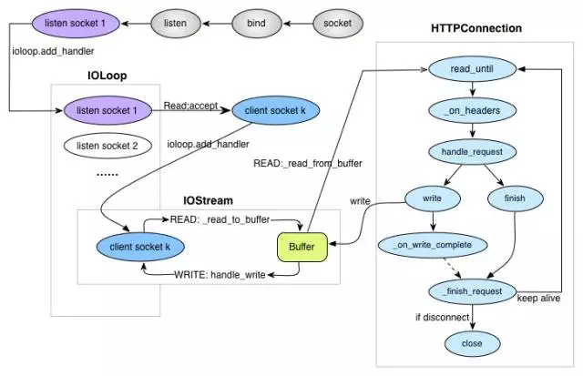

# 线上大量CLOSE_WAIT分析

这一次重启真的无法解决问题了：一次 **MySQL** 主动关闭，导致服务出现大量 **CLOSE_WAIT** 的全流程排查过程。

近日遇到一个线上服务 **socket** 资源被不断打满的情况。通过各种工具分析线上问题,定位到问题代码。这里对该问题发现、修复过程进行一下复盘总结。

先看两张图。一张图是服务正常时监控到的 **socket** 状态，另一张当然就是异常啦！



​										正常情况



​										异常情况

从图中的表现情况来看，就是从 **04:00** 开始，socket 资源不断上涨，每个谷底时重启后恢复到正常值，然后继续不断上涨不释放，而且每次达到峰值的间隔时间越来越短。

重启后，排查了日志，没有看到 **panic** ，此时也就没有进一步检查，真的以为重启大法好。

# 情况说明

问题出现在早上 **08:20** 左右开始的，报警收到该服务出现 **504**，此时第一反应是该服务长时间没有重启（快两个月了），可能存在一些内存泄漏，没有多想直接进行了重启。也就是在图二第一个谷底的时候，经过重启服务恢复到正常水平（重启真好用，开心）。

将近 **14:00** 的时候，再次被告警出现了 **504** ，当时心中略感不对劲，但由于当天恰好有一场大型促销活动，因此先立马再次重启服务。直到后续大概过了1小时后又开始告警，连续几次重启后，发现需要重启的时间间隔越来越短。此时发现问题绝不简单。**这一次重启真的解决不了问题老**，因此立马申请机器权限、开始排查问题。下面的截图全部来源我的重现demo，与线上无关。

# 发现问题

出现问题后，首先要进行分析推断、然后验证、最后定位修改。根据当时的表现是分别进行了以下猜想。

*ps：后续截图全部来源自己本地复现时的截图*

## 推断一

> socket 资源被不断打满，并且之前从未出现过，今日突然出现，**怀疑是不是请求量太大压垮服务**


经过查看实时 **qps** 后，放弃该想法，虽然量有增加，但依然在服务器承受范围（远远未达到压测的基准值）。

## 推断二

> 两台机器故障是同时发生，重启一台，另外一台也会得到缓解，作为独立部署在两个集群的服务非常诡异

有了上面的的依据，推出的结果是肯定是该服务依赖的底层资源除了问题，要不然不可能独立集群的服务同时出问题。

由于监控显示是 **socket** 问题，因此通过 **netstat** 命令查看了当前tcp链接的情况（本地测试，线上实际值大的多）

```shell
/go/src/hello # netstat -na | awk '/^tcp/ {++S[$NF]} END {for(a in S) print a, S[a]}'
LISTEN 2
CLOSE_WAIT 23 # 非常异常
TIME_WAIT 1
```

发现绝大部份的链接处于 **CLOSE_WAIT** 状态，这是非常不可思议情况。然后用 `netstat -an` 命令进行了检查。



​															**图四：大量的CLOSE_WAIT**

> CLOSED 表示socket连接没被使用。
> LISTENING 表示正在监听进入的连接。
> SYN_SENT 表示正在试着建立连接。
> SYN_RECEIVED 进行连接初始同步。
> ESTABLISHED 表示连接已被建立。
> CLOSE_WAIT 表示远程计算器关闭连接，正在等待socket连接的关闭。
> FIN_WAIT_1 表示socket连接关闭，正在关闭连接。
> CLOSING 先关闭本地socket连接，然后关闭远程socket连接，最后等待确认信息。
> LAST_ACK 远程计算器关闭后，等待确认信号。
> FIN_WAIT_2 socket连接关闭后，等待来自远程计算器的关闭信号。
> TIME_WAIT 连接关闭后，等待远程计算器关闭重发。

然后开始重点思考为什么会出现大量的mysql连接是 **CLOSE_WAIT** 呢？为了说清楚，我们来插播一点TCP的四次挥手知识。

### TCP四次挥手

我们来看看 **TCP** 的四次挥手是怎么样的流程：




用中文来描述下这个过程：

Client: `服务端大哥，我事情都干完了，准备撤了`，这里对应的就是客户端发了一个**FIN**

Server：`知道了，但是你等等我，我还要收收尾`，这里对应的就是服务端收到 **FIN** 后回应的 **ACK**

经过上面两步之后，服务端就会处于 **CLOSE_WAIT** 状态。过了一段时间 **Server** 收尾完了

Server：`小弟，哥哥我做完了，撤吧`，服务端发送了**FIN**

Client：`大哥，再见啊`，这里是客户端对服务端的一个 **ACK**

到此服务端就可以跑路了，但是客户端还不行。为什么呢？客户端还必须等待 **2MSL** 个时间，这里为什么客户端还不能直接跑路呢？主要是为了防止发送出去的 **ACK** 服务端没有收到，服务端重发 **FIN** 再次来询问，如果客户端发完就跑路了，那么服务端重发的时候就没人理他了。这个等待的时间长度也很讲究。

> **Maximum Segment Lifetime** 报文最大生存时间，它是任何报文在网络上存在的最长时间，超过这个时间报文将被丢弃

这里一定不要被图里的 **client／server** 和项目里的客户端服务器端混淆，你只要记住：主动关闭的一方发出 **FIN** 包（Client），被动关闭（Server）的一方响应 **ACK** 包，此时，被动关闭的一方就进入了 **CLOSE_WAIT** 状态。如果一切正常，稍后被动关闭的一方也会发出 **FIN** 包，然后迁移到 **LAST_ACK** 状态。

既然是这样， **TCP** 抓包分析下：

```shell
/go # tcpdump -n port 3306
# 发生了 3次握手
11:38:15.679863 IP 172.18.0.5.38822 > 172.18.0.3.3306: Flags [S], seq 4065722321, win 29200, options [mss 1460,sackOK,TS val 2997352 ecr 0,nop,wscale 7], length 0
11:38:15.679923 IP 172.18.0.3.3306 > 172.18.0.5.38822: Flags [S.], seq 780487619, ack 4065722322, win 28960, options [mss 1460,sackOK,TS val 2997352 ecr 2997352,nop,wscale 7], length 0
11:38:15.679936 IP 172.18.0.5.38822 > 172.18.0.3.3306: Flags [.], ack 1, win 229, options [nop,nop,TS val 2997352 ecr 2997352], length 0

# mysql 主动断开链接
11:38:45.693382 IP 172.18.0.3.3306 > 172.18.0.5.38822: Flags [F.], seq 123, ack 144, win 227, options [nop,nop,TS val 3000355 ecr 2997359], length 0 # MySQL负载均衡器发送fin包给我
11:38:45.740958 IP 172.18.0.5.38822 > 172.18.0.3.3306: Flags [.], ack 124, win 229, options [nop,nop,TS val 3000360 ecr 3000355], length 0 # 我回复ack给它

... ... # 本来还需要我发送fin给他，但是我没有发，所以出现了close_wait。那这是什么缘故呢？
```

**src > dst: flags data-seqno ack window urgent options**

src > dst 表明从源地址到目的地址
flags 是TCP包中的标志信息,S 是SYN标志, F(FIN), P(PUSH) , R(RST) “.”(没有标记)
data-seqno 是数据包中的数据的顺序号
ack 是下次期望的顺序号
window 是接收缓存的窗口大小
urgent 表明数据包中是否有紧急指针
options 是选项


结合上面的信息，我用文字说明下：**MySQL负载均衡器** 给我的服务发送 **FIN** 包，我进行了响应，此时我进入了 **CLOSE_WAIR** 状态，但是后续作为被动关闭方的我，并没有发送 **FIN**，导致我服务端一直处于 **CLOSE_WAIR** 状态，无法最终进入 **CLOSED** 状态。

那么我推断出现这种情况可能的原因有以下几种：

1. **负载均衡器** 异常退出了，

   `这基本是不可能的，他出现问题绝对是大面积的服务报警，而不仅仅是我一个服务`

2. **MySQL负载均衡器** 的超时设置的太短了，导致业务代码还没有处理完，**MySQL负载均衡器** 就关闭tcp连接了

   `这也不太可能，因为这个服务并没有什么耗时操作，当然还是去检查了负载均衡器的配置，设置的是60s。`

3. 代码问题，**MySQL** 连接无法释放

   `目前看起来应该是代码质量问题，加之本次数据有异常，触发到了以前某个没有测试到的点，目前看起来很有可能是这个原因`

   # 查找错误原因

   由于代码的业务逻辑并不是我写的，我担心一时半会看不出来问题，所以直接使用 `perf` 把所有的调用关系使用火焰图给绘制出来。既然上面我们推断代码中没有释放mysql连接。无非就是：

   1. 确实没有调用close
   2. 有耗时操作（火焰图可以非常明显看到），导致超时了
   3. mysql的事务没有正确处理，例如：rollback 或者 commit

   由于火焰图包含的内容太多，为了让大家看清楚，我把一些不必要的信息进行了折叠。

   

火焰图很明显看到了开启了事务，但是在余下的部分，并没有看到 **Commit** 或者是**Rollback** 操作。这肯定会操作问题。然后也清楚看到出现问题

**MainController.update** 方法内部，话不多说，直接到 update 方法中去检查。发现了如下代码：

```go
func (c *MainController) update() (flag bool) {
	o := orm.NewOrm()
	o.Using("default")
	
	o.Begin()
	nilMap := getMapNil()
	if nilMap == nil {// 这里只检查了是否为nil，并没有进行rollback或者commit
		return false
	}

	nilMap[10] = 1
	nilMap[20] = 2
	if nilMap == nil && len(nilMap) == 0 {
		o.Rollback()
		return false
	}

	sql := "update tb_user set name=%s where id=%d"
	res, err := o.Raw(sql, "Bug", 2).Exec()
	if err == nil {
		num, _ := res.RowsAffected()
		fmt.Println("mysql row affected nums: ", num)
		o.Commit()
		return true
	}

	o.Rollback()
	return false
}
```

至此，全部分析结束。经过查看 **getMapNil** 返回了nil，但是下面的判断条件没有进行回滚。

```go
if nilMap == nil {
    o.Rollback()// 这里进行回滚
    return false
}
```


如何看火焰图？拿一个正确的火焰图和错误的对比：

正确的


有问题的火焰图


# 总结

整个分析过程还是废了不少时间。最主要的是主观意识太强，觉得运行了一年没有出问题的为什么会突然出问题？因此一开始是质疑 SRE、DBA、各种基础设施出了问题（人总是先怀疑别人）。导致在这上面费了不少时间。

理一下正确的分析思路：

1. 出现问题后，立马应该检查日志，确实日志没有发现问题；
2. 监控明确显示了socket不断增长，很明确立马应该使用 `netstat` 检查情况看看是哪个进程的锅；
3. 根据 `netstat` 的检查，使用 `tcpdump` 抓包分析一下为什么连接会**被动断开**（TCP知识非常重要）；
4. 如果熟悉代码应该直接去检查业务代码，如果不熟悉则可以使用 `perf` 把代码的调用链路打印出来；
5. 不论是分析代码还是火焰图，到此应该能够很快定位到问题。

那么本次到底是为什么会出现 **CLOSE_WAIT** 呢？大部分同学应该已经明白了，我这里再简单说明一下：

由于那一行代码没有对事务进行回滚，导致服务端没有主动发起close。因此 **MySQL负载均衡器** 在达到 60s 的时候主动触发了close操作，但是通过tcp抓包发现，服务端并没有进行回应，这是因为代码中的事务没有处理，因此从而导致大量的端口、连接资源被占用。在贴一下挥手时的抓包数据：

```shell
# mysql 主动断开链接
11:38:45.693382 IP 172.18.0.3.3306 > 172.18.0.5.38822: Flags [F.], seq 123, ack 144, win 227, options [nop,nop,TS val 3000355 ecr 2997359], length 0 # MySQL负载均衡器发送fin包给我
11:38:45.740958 IP 172.18.0.5.38822 > 172.18.0.3.3306: Flags [.], ack 124, win 229, options [nop,nop,TS val 3000360 ecr 3000355], length 0 # 我回复ack给它
```


# 又见CLOSE_WAIT

**环境简述**

要说清楚问题，先要简单说下生产环境的网络拓扑 （毕竟是个网络问题对吧）



看，挺简单的对吧，一个OpenResty做SLB承受客户端请求，后向代理到几台应用服务器。由于业务要求，必须要同步调用第三方运营商的接口并返回结果到客户端。

**怎么“挂”了**

深夜接到某妹子电话本该是激动人心的事，但是奈何怎么都高兴不起来，因为来电是来告诉我环境挂了。赶紧问清楚，回答说是一开始响应很慢，后来就彻底拿不到数据了。

好吧，自己摸出手机试下，果然.... 此时夜里11点。

**第一反应 （请注意，这里开始是我的排错思路）**

从开始打开电脑到电脑点亮的时间里我已经想好了一个初步的排错检查思路， 既然是拿不到数据，那有哪些可能呢？

- 是不是特例还是所有情况下的数据都获取不到？
- 是不是网络断了（比如某厂的光缆又断了？）
- 是不是服务停了 （Sig 11？OOM？或者core dump）
- 是不是应用服务器都CPU 100%了？
- 看看监控系统有没有报警？ （当然得有对吧）
- 看看DB是不是被人删了？（进过某旅游网站的事件后，这总也是一种可能行对吧）

好，因为我们有云监控，看了下

- SLB的心跳还活着，排除网络问题
- 所有服务器的CPU／Memory／IO都还正常没有峰值
- 关键进程还在
- DB也还健在（还好 还好）

**开始检查**

既然初步排除上述的问题，那下一步基本就是SSH到服务器上去看情况了。 自然从网络开始，*这里要想说给很多在做或者即将做在线生产环境支持的小伙伴说的第一句话： “先听听操作系统的声音，让操作系统来告诉你问题在哪”。 不论是windows和Linux都提供了一堆小工具小命令，在过度依赖安装第三方工具前请先看看是否操作系统自带的工具已经不够支撑你了。*

好，第一个检查就是本机的网络连接*netstat -anop tcp*,  结果


我擦，close_wait又让我撞见了. 看了几台应用服务器都是上百个close_wait. （加起来有近千个close_wait, 发财了）。

网上有太多文章描述这个东西了所以我不会展开去解释，就浓缩成以下几点，大家参考这图理解



- close_wait 是TCP关闭连接过程中的一个正常状态
- close_wait只会发生在**被**动关闭链接的那一端（各位亲，请不要把图里的client／server和项目里的客户端服务器端混淆）
- close_wait除非你杀进程，close_wait是不会自动消失的。当然不消失意味着占着资源呢，这里就是占着FD。

看到这里基本拿不到数据的原因之一找到了，大量的close_wait. 我之前项目也见过有的开发见到这种情况的直觉反应就是重启大法，其实也不能算这个做法有错，毕竟这个时候服务当了，客户疯了，夜已深了，你想休息了。 但，这样真的对吗？

**“停” 先别急着重启**

如果你这时候重启了，的确立竿见影解决了当前问题，但你却失去真正解决问题的机会。这就是我想说的第二句话： “保留一下现场，不是所有问题的根源都能从日志里找得到的”。 close_wait 绝对就是这类问题，如果你是一位有过类似经历的开发或者DevOps，你到现在应该有了下面2个疑问：

1. 为啥一台机器区区几百个close_wait就导致不可继续访问？不合理啊，一台机器不是号称最大可以开到65535个端口吗？
2. 为啥明明有多个服务器承载，却几乎同时出了close_wait? 又为什么同时不能再服务？那要SLB还有啥用呢

好，这也是我当时的问题，让我们继续往下分析：

- **先理顺出现close_wait的链接流向**

前面说过close_wait是关闭连接过程中的正常状态，但是正常情况下close_wait的状态很快就会转换所以很难被捕捉到。所以如果你能发现大批量的close_wait基本可以确定是出问题了。那第一个要确定的自然是连接的流向，判断依据很简单（还是netstat -anop tcp）


命令返回里有一栏Foreign Address，这个就是代表对方的IP地址，这个时候再结合上面那张TCP的握手图，我们就知道是哪台机器和你连接着但是却主动关闭了连接。

- **根据项目数据请求流向还原可能的场景**

知道了是哪台IP，那接下来就可以根据项目实际情况还原连接的场景。在我这里所有的close_wait都发生在和SLB的连接上。因此说明，是SLB主动关闭了连接但是多台应用服务器都没有响应ack 导致了close_wait. 只是这样够吗？ 明显不够。继续

SLB 作为负载均衡，基本没有业务逻辑，那它会主动关闭连接的场景有哪些？

- SLB 作为负载均衡，基本没有业务逻辑，那它会主动关闭连接的场景有哪些？
- TCP 连接超时

这2个情况很好判断而且大多数情况下是第二种（我遇见的也是），如果你还记得我文章一开始的环境结构图，我想基本可以得出以下结论是：     由于调用第三方的请求API太慢而导致SLB这边请求超时引起的SLB关闭了连接.

那解决方案也很容易就有了：

-   加大SLB到应用服务器的连接超时时间
-   在调用第三方的时候采用异步请求

完了吗？ （我怎么那么啰嗦。。。）

**“再等等” 还有问题没被回答**

我们还有两个问题没回答：

1. 为啥一台机器区区几百个close_wait就导致不可继续访问？不合理啊，一台机器不是号称最大可以开到65535个端口吗？
2. 为啥明明有多个服务器承载，却几乎同时出了close_wait? 又为什么同时不能再服务？那要SLB还有啥用呢

是啊，解释了为什么出close_wait, 但并不能解释这2个问题。好吧，既然找到了第一层原因，就先重启服务让服务可以用吧。剩下的我们可以用个简单的原型代码模拟一下。此时我的目光回到了我们用的Tornado上面来，“当你有问题解释不了的时候，你还没有发现正真的问题”

Tornado是一个高性能异步非阻塞的HTTP 服务器（还不明白这个啥意思的可以看 “从韩梅梅和林涛的故事中，学习一下I/O模型 ” 这篇文章，生动！！！），其核心类就是IOLoop，默认都是用HttpServer单进程单线程的方式启动 (Tornado的process.fork_processes 也支持多进程方式，但官方并不建议)。我们还是通过图来大概说下

IOLoop干了啥：



- 维护每个listen socket注册的fd；
- 当listen socket可读时回调_handle_events处理客户端请求，这里面的实现就是基于epoll 模型

好，现在我们知道：

1. Tornado是单进程启动的服务，所以IOLoop也就一个实例在监听并轮询
2. IOLoop在监听端口，当对应的fd ready时会回调注册的handler去处理请求，这里的handler就是我们写业务逻辑的RequestHandler
3. 如果我们启用了Tornado的 @tornado.gen.coroutine，那理论上一个请求很慢不会影响其他的请求，那一定是代码什么地方错了。

进而查看实现代码，才真相大白，虽然我们用了 @tornado.gen.coroutine 和yield，但是在向第三方请求时用的是urllib2 库。这是一个彻头彻尾的同步库，人家就不支持AIO（Tornado 有自己AsyncHTTPClient支持AIO). 

由此让我们来总结下原因：

1.  Tornado是单进程启动的服务，所以IOLoop也就一个实例在监听并轮询
2. Tornado在bind每个socket的时候有默认的链接队列（也叫backlog）为128个
3. 由于代码错误，我们使用了同步库urllib2 做第三方请求，导致访问第三方的时候当前RequestHandler是同步的（yield不起作用），因此当IOLoop回调这个RequestHandler时会等待它返回
4. 第三方接口真的不快！

最后来回答这两个问题：

1. 为啥一台机器区区几百个close_wait就导致不可继续访问？不合理啊，一台机器不是号称最大可以开到65535个端口吗？

[回答]： 由于原因＃4和＃3所以导致整个IOLoop慢了，进而因为＃2 导致很多请求堆积，也就是说很多请求在被真正处理前已经在backlog里等了一会了。导致了SLB这端的链接批量的超时，同时又由于close_wait状态不会自动消失，导致最终无法再这个端口上创建新的链接引起了停止服务

2. 为啥明明有多个服务器承载，却几乎同时出了close_wait? 又为什么同时不能再服务？那要SLB还有啥用呢

[回答]： 有了上一个答案，结合SLB的特性，这个也就很好解释。这就是所谓的洪水蔓延，当SLB发现下面的一个节点不可用时会吧请求routing到其他可用节点上，导致了其他节点压力增大。也犹豫相同原因，加速了其他节点出现close_wait.

