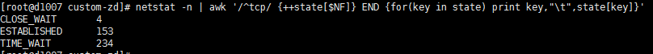
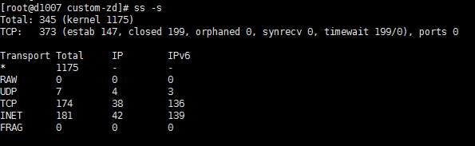
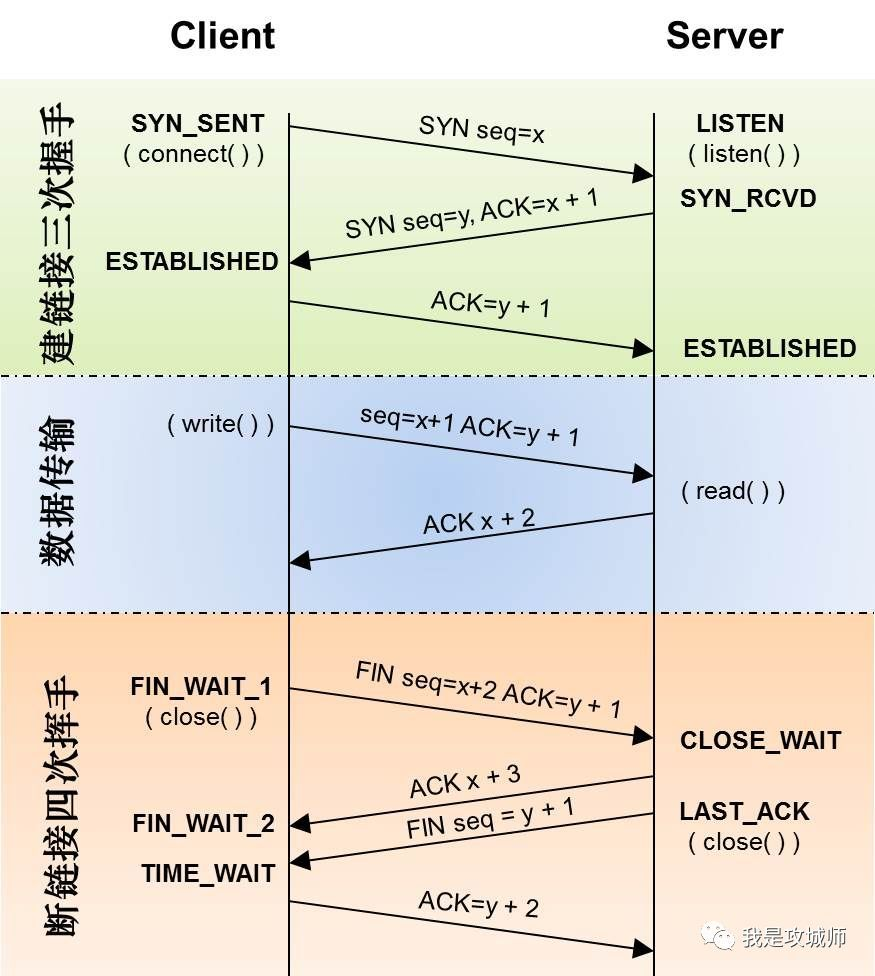

## 高并发下TCP链接产生大量的TIME_WAIT状态

### **问题场景**

线上有几台QPS每秒几万请求的服务器，大致访问链路如下：client -> nginx -> web 服务器，由于每台机器上混布了多个web服务并通过nginx反向代理统一分发请求，在服务升级的时候经常出现端口被占用的情况，排查问题时，发现系统过存在几万多个 

time_wait状态。统计命令如下：

第一种使用netstat（性能一般）

```shell
netstat -n | awk '/^tcp/ {++state[$NF]} END {for(key in state) print key,"\t",state[key]}'
```



第二种使用ss命令（性能较高）

```shell
ss -s
```




### **TIME_WAIT状态是如何产生的？**

我们来看下TCP的状态机图：




通过上图，我们可以看到TIME_WAIT状态是在tcp断开链接时产生的，因为TCP连接是双向的，所以在关闭连接的时候，两个方向各自都需要关闭。先发FIN包的一方执行的是主动关闭；后发FIN包的一方执行的是被动关闭。主动关闭的一方会进入TIME_WAIT状态，并且在此状态停留两倍的MSL时长。 

MSL指的是报文段的最大生存时间，如果报文段在网络活动了MSL时间，还没有被接收，那么会被丢弃。关于MSL的大小，RFC 793协议中给出的建议是两分钟，不过实际上不同的操作系统可能有不同的设置，以Linux为例，通常是半分钟，两倍的MSL就是一分钟，也就是60秒，并且这个数值是硬编码在内核中的，也就是说除非你重新编译内核，否则没法修改它。

TIME_WAIT状态存在的必要性。虽然双方都同意关闭连接了，而且握手的4个报文也都协调和发送完毕，按理可以直接回到CLOSED状态（就好比从SYN_SEND状态到ESTABLISH状态那样）；但是因为我们必须要假想网络是不可靠的，你无法保证你最后发送的ACK报文会一定被对方收到，比如丢包或者延迟到达，因此对方处于LAST_ACK状态下的SOCKET可能会因为超时未收到ACK报文，而重发FIN报文，所以这个TIME_WAIT状态的作用就是用来重发可能丢失的ACK报文，并保证于此。

简单说timewait之所以等待2MSL的时长，是为了避免因为网络丢包或者网络延迟而造成的tcp传输不可靠，而这个time_wait状态则可以最大限度的提升网络传输的可靠性。

### **TIME_WAIT状态过多的危害**

TIME_WAIT状态是TCP链接中正常产生的一个状态，但凡事都有利弊，TIME_WAIT状态过多会存在以下的问题：

（1）在socket的TIME_WAIT状态结束之前，该socket所占用的本地端口号将一直无法释放。这也是文章开头的提到问题的一个原因之一。

（2）在高并发（每秒几万qps）并且采用短连接方式进行交互的系统中运行一段时间后，系统中就会存在大量的time_wait状态，如果time_wait状态把系统所有可用端口 

都占完了且尚未被系统回收时，就会出现无法向服务端创建新的socket连接的情况。此时系统几乎停转，任何链接都不能建立。

（3)大量的time_wait状态也会系统一定的fd，内存和cpu资源，当然这个量一般比较小，并不是主要危害

### **如何优化TIME_WAIT过多的问题**

总体来说，有两种方式：

方式一：调整系统内核参数

修改/etc/sysctl.conf文件，一般涉及下面的几个参数：

```shell
net.ipv4.tcp_syncookies = 1 #表示开启SYN Cookies。当出现SYN等待队列溢出时，启用cookies来处理，可防范少量SYN攻击，默认为0，表示关闭；
net.ipv4.tcp_tw_reuse = 1 #表示开启重用。允许将TIME-WAIT sockets重新用于新的TCP连接，默认为0，表示关闭；
net.ipv4.tcp_tw_recycle = 1 #表示开启TCP连接中TIME-WAIT sockets的快速回收，默认为0，表示关闭。
net.ipv4.tcp_fin_timeout =  #修改系统默认的 TIMEOUT 时间
net.ipv4.tcp_max_tw_buckets = 5000 #表示系统同时保持TIME_WAIT套接字的最大数量，(默认是18000). 当TIME_WAIT连接数量达到给定的值时，所有的TIME_WAIT连接会被立刻清除，并打印警告信息。但这种粗暴的清理掉所有的连接，意味着有些连接并没有成功等待2MSL，就会造成通讯异常。一般不建议调整
net.ipv4.tcp_timestamps = 1 #(默认即为1)60s内同一源ip主机的socket connect请求中的timestamp必须是递增的。也就是说服务器打开了 tcp_tw_reccycle了，就会检查时间戳，如果对方发来的包的时间戳是乱跳的或者说时间戳是滞后的，那么服务器就会丢掉不回包，现在很多公司都用LVS做负载均衡，通常是前面一台LVS，后面多台后端服务器，这其实就是NAT，当请求到达LVS后，它修改地址数据后便转发给后端服务器，但不会修改时间戳数据，对于后端服务器来说，请求的源地址就是LVS的地址，加上端口会复用，所以从后端服务器的角度看，原本不同客户端的请求经过LVS的转发，就可能会被认为是同一个连接，加之不同客户端的时间可能不一致，所以就会出现时间戳错乱的现象，于是后面的数据包就被丢弃了，具体的表现通常是是客户端明明发送的SYN，但服务端就是不响应ACK，还可以通过下面命令来确认数据包不断被丢弃的现象，所以根据情况使用

#其他优化：

net.ipv4.ip_local_port_range = 1024 65535 #增加可用端口范围，让系统拥有的更多的端口来建立链接，这里有个问题需要注意，对于这个设置系统就会从1025~65535这个范围内随机分配端口来用于连接，如果我们服务的使用端口比如8080刚好在这个范围之内，在升级服务期间，可能会出现8080端口被其他随机分配的链接给占用掉，这个原因也是文章开头提到的端口被占用的另一个原因
net.ipv4.ip_local_reserved_ports = 7005,8001-8100 #针对上面的问题，我们可以设置这个参数来告诉系统给我们预留哪些端口，不可以用于自动分配。
```

优化完内核参数后，可以执行sysctl -p命令，来激活上面的设置永久生效

方式二：调整短链接为长链接

短连接和长连接工作方式的区别：

短连接 

连接->传输数据->关闭连接 

HTTP是无状态的，浏览器和服务器每进行一次HTTP操作，就建立一次连接，但任务结束就中断连接。 

也可以这样说：短连接是指SOCKET连接后发送后接收完数据后马上断开连接。

长连接 

连接->传输数据->保持连接 -> 传输数据-> 。。。->关闭连接。 

长连接指建立SOCKET连接后不管是否使用都保持连接，但安全性较差。

从区别上可以看出，长连接比短连接从根本上减少了关闭连接的次数，减少了TIME_WAIT状态的产生数量，在高并发的系统中，这种方式的改动非常有效果，可以明显减少系统TIME_WAIT的数量。

当使用nginx作为反向代理时，为了支持长连接，需要做到两点：

从client到nginx的连接是长连接 

从nginx到server的连接是长连接

1、保持和client的长连接：

默认情况下，nginx已经自动开启了对client连接的keep alive支持（同时client发送的HTTP请求要求keep alive）。一般场景可以直接使用，但是对于一些比较特殊的场景，还是有必要调整个别参数（keepalive_timeout和keepalive_requests）。

```shell
http {
    keepalive_timeout  120s 120s;
    keepalive_requests 10000;
}
```

keepalive_timeout: 第一个参数：设置keep-alive客户端连接在服务器端保持开启的超时值（默认75s）；值为0会禁用keep-alive客户端连接； 

第二个参数：可选、在响应的header域中设置一个值“Keep-Alive: timeout=time”；通常可以不用设置；

keepalive_requests：keepalive_requests指令用于设置一个keep-alive连接上可以服务的请求的最大数量，当最大请求数量达到时，连接被关闭。默认是100。这个参数的真实含义，**是指一个keep alive建立之后，nginx就会为这个连接设置一个计数器，记录这个keep alive的长连接上已经接收并处理的客户端请求的数量。如果达到这个参数设置的最大值时，则nginx会强行关闭这个长连接，逼迫客户端不得不重新建立新的长连接**。 

大多数情况下当QPS(每秒请求数)不是很高时，默认值100凑合够用。但是，对于一些QPS比较高（比如超过10000QPS，甚至达到30000,50000甚至更高) 的场景，默认的100就显得太低。 

简单计算一下，QPS=10000时，客户端每秒发送10000个请求(通常建立有多个长连接)，每个连接只能最多跑100次请求，意味着平均每秒钟就会有100个长连接因此被nginx关闭。同样意味着为了保持QPS，客户端不得不每秒中重新新建100个连接。因此，就会发现有大量的TIME_WAIT的socket连接(即使此时keep alive已经在client和nginx之间生效)。因此对于QPS较高的场景，非常有必要加大这个参数，以避免出现大量连接被生成再抛弃的情况，减少TIME_WAIT。

2、保持和server的长连接

为了让nginx和后端server（nginx称为upstream）之间保持长连接，典型设置如下：（默认nginx访问后端都是用的短连接(HTTP1.0)，一个请求来了，Nginx 新开一个端口和后端建立连接，后端执行完毕后主动关闭该链接）Nginx 1.1以上版本的upstream已经支持keep-alive的，所以我们可以开启Nginx proxy的keep-alive来减少tcp连接：

```shell
upstream http_backend {
 server 127.0.0.1:8080;

 keepalive 1000;//设置nginx到upstream服务器的空闲keepalive连接的最大数量
}

server {
 ...

location /http/ {
 proxy_pass http://http_backend;
 proxy_http_version 1.1;//开启长链接
 proxy_set_header Connection "";
 ...
 }
}

```

HTTP协议中对长连接的支持是从1.1版本之后才有的，因此最好通过proxy_http_version指令设置为"1.1"，而"Connection" header应该被清理。清理的意思，是清理从client过来的http header，因为即使是client和nginx之间是短连接，nginx和upstream之间也是可以开启长连接的。这种情况下必须清理来自client请求中的"Connection" header。但这个地方需要注意如果有一些认证鉴权的cookie或者session信息在head里面，不建议开启此选项，或者对需要保留的header要保存下来，否则这些信息可能会丢掉从而发不到上游upstream的服务器上。

### **总结**

本文主要介绍了在高并发场景中系统存在大量的TIME_WAIT的问题和优化策略，通过调整内核参数+nginx长链接优化方式，最终将几万的TIME_WAIT状态给下降的到几千，效果还是非常明显的，如果有遇到类似的情况，可以参考下本文的解决方式。

参考链接： 

http://www.52im.net/thread-1003-1-1.html 

https://skyao.gitbooks.io/learning-nginx/content/documentation/keep_alive.html 

https://lanjingling.github.io/2016/06/11/nginx-https-keepalived-youhua/ 

https://www.itnotebooks.com/?p=1180